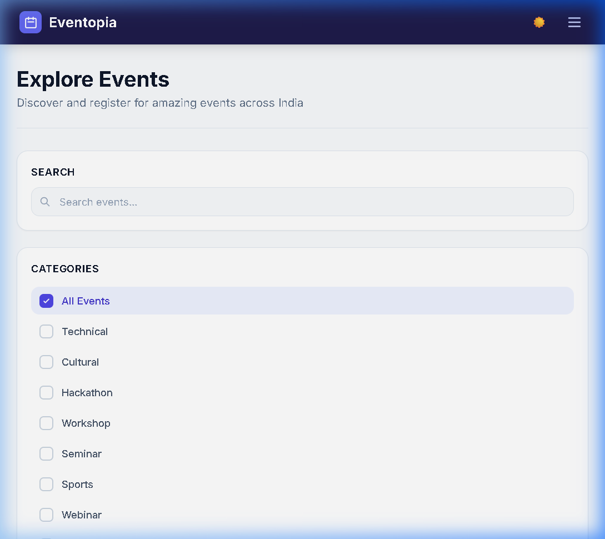
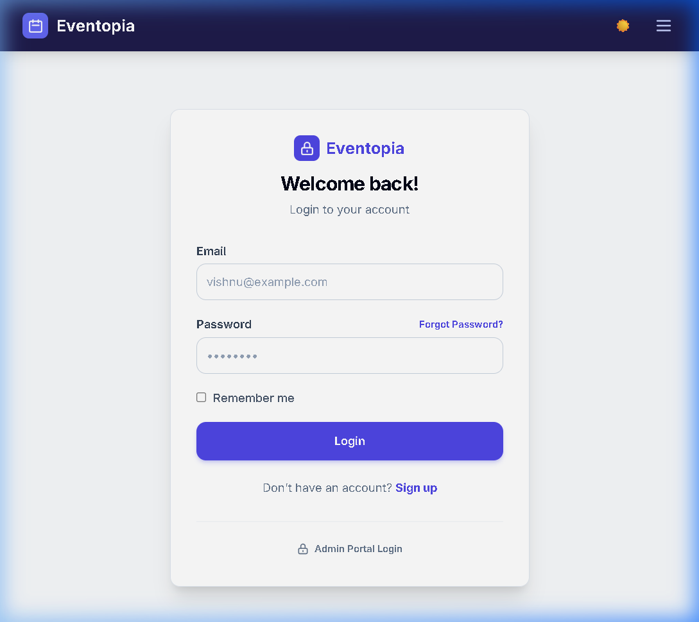
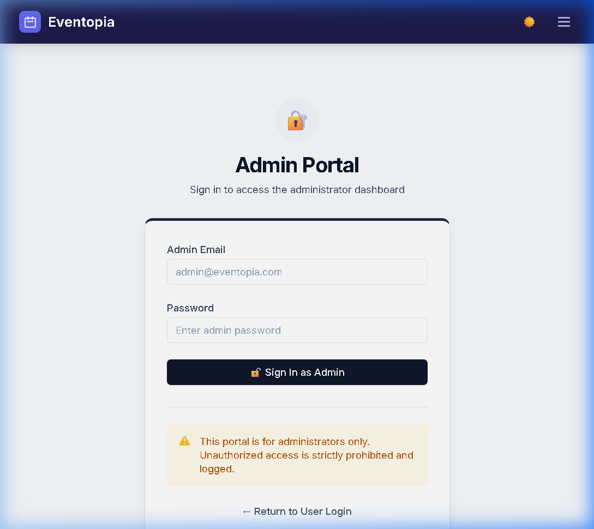
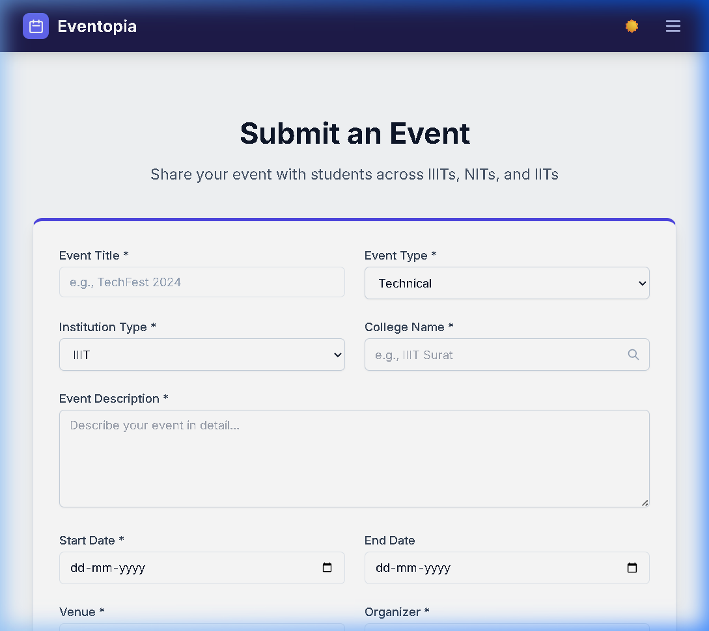
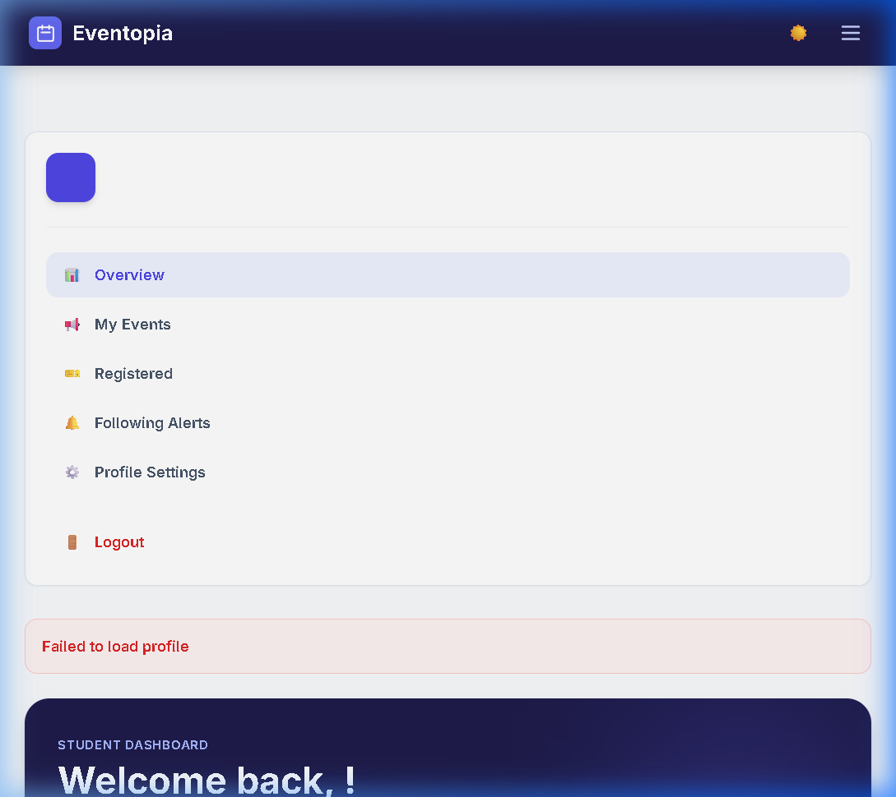

# Eventopia

Eventopia is a simple event discovery and management platform for college events (IITs, NITs, IIITs and others). It provides a React + Vite frontend and an Express + MongoDB backend. Users can sign up, submit events, register for events, and admins can approve or reject submitted events.

<!-- NOTE: Upload screenshots to the `images/` folder and replace the placeholders below -->

## Screenshots




## Features

- User authentication (register / login)



- Submit and manage events (create, update, delete)


- Browse events by college or institution type (IIT / NIT / IIIT)
- Admin approval workflow for submitted events
- Register / unregister for events
- Unified User Profile (Manage personal info, submitted events, and registrations)

- **Following & Alerts System:** Follow specific institutes or categories to receive real-time in-app notifications and email alerts when new events are approved.

## Tech Stack

- Frontend: React, Vite, Tailwind CSS
- Backend: Node.js, Express
- Database: MongoDB (Mongoose)
- Authentication: JSON Web Tokens (JWT)

## Repo Structure (important files)

- `backend/` - Express API
	- `server.js` - App entrypoint
	- `routes/` - Express route modules (`auth`, `events`, `users`)
	- `controllers/` - Route handlers and business logic
	- `models/` - Mongoose models (`User`, `Event`)
- `frontend/` - React + Vite application
	- `src/` - React sources (components, pages, services)
- `images/` - Add screenshots and other assets here

## Prerequisites

- Node.js (v16+ recommended)
- npm (comes with Node.js)
- MongoDB instance (local or hosted e.g., MongoDB Atlas)

## Environment Variables

Create a `.env` file inside `backend/` with these variables (example):

```
PORT=5000
MONGODB_URI=mongodb://localhost:27017/eventopia
JWT_SECRET=your_jwt_secret_here
JWT_EXPIRE=30d
CLIENT_URL=http://localhost:5173
NODE_ENV=development

# Email Configuration (for Nodemailer alerts)
EMAIL_HOST=smtp.gmail.com
EMAIL_PORT=587
EMAIL_USER=your_email@gmail.com
EMAIL_PASSWORD=your_app_password
```

- `MONGODB_URI`: MongoDB connection string
- `JWT_SECRET`: Secret used to sign JWTs
- `JWT_EXPIRE`: Token expiration (e.g. `30d`)
- `CLIENT_URL` or `CORS_ORIGIN`: Frontend origin(s) for CORS (comma-separated)
- `PORT`: Backend port (defaults to `5000`)
- `EMAIL_*`: Credentials for Nodemailer (use an App Password for Gmail)

## Running Locally (Windows PowerShell)

1) Start the backend

```powershell
cd backend
npm install
# create .env with values shown above
npm run dev
```

The backend will listen on the port defined in `.env` (default `5000`).

2) Start the frontend

```powershell
cd frontend
npm install
npm run dev
```

The frontend development server uses Vite (default `http://localhost:5173`). Ensure `CLIENT_URL` or `CORS_ORIGIN` includes that origin for development.

## Running with Docker Compose

Ensure the entire application is portable and runs with a single command using Docker.

### Prerequisites

- **Docker Desktop** installed and running on your system.
- **Docker Compose v2** (included with Docker Desktop).

### Environment Setup

1. Copy the root `.env.example` to a new root file named `.env`:
   ```bash
   cp .env.example .env
   ```
2. Adjust environment parameters if required (defaults are configured to work out-of-the-box for local testing).

### Running the Application

Start all services (MongoDB, Express Backend, Nginx-served Frontend, Redis, and Kafka):

```bash
docker compose up --build -d
```

- `--build`: Re-builds local docker images (first run or when backend/frontend code updates).
- `-d`: Runs containers in detached background mode.

### Ports and Access

Once running, access services at:
- **Frontend App**: `http://localhost:3000`
- **Backend API**: `http://localhost:5000`
- **MongoDB**: `localhost:27017`
- **Redis (Placeholder)**: `localhost:6379`
- **Kafka (Placeholder)**: `localhost:9092`

### Checking Logs

To view real-time logs from all containers:
```bash
docker compose logs -f
```

To view logs for a specific service:
```bash
docker compose logs -f backend
```

### Stopping Services

Stop and preserve database volumes:
```bash
docker compose down
```

Stop and completely reset local volumes (clears MongoDB and Redis storage):
```bash
docker compose down -v
```

---

## API Endpoints (overview)

Base: `/api`

- Auth
	- `POST /api/auth/register` - Register a new user
	- `POST /api/auth/login` - Login and receive JWT
	- `GET /api/auth/me` - Get current user (requires auth)
	- `PUT /api/auth/updateprofile` - Update profile (requires auth)
	- `PUT /api/auth/updatepassword` - Update password (requires auth)

- Events
	- `GET /api/events` - Get all events (supports query filters)
	- `GET /api/events/:id` - Get event by ID
	- `GET /api/events/college/:collegeName` - Events by college
	- `GET /api/events/institution/:institutionType` - Events by institution (IIT/NIT/IIIT)
	- `POST /api/events` - Create event (requires auth)
	- `PUT /api/events/:id` - Update event (requires auth, owner or admin)
	- `DELETE /api/events/:id` - Delete event (requires auth, owner or admin)
	- `POST /api/events/:id/register` - Register for event (requires auth)
	- `POST /api/events/:id/unregister` - Unregister from event (requires auth)
	- `PUT /api/events/:id/approve` - Approve event (admin only)
	- `PUT /api/events/:id/reject` - Reject event (admin only)

- Users
	- `GET /api/users/events` - Get events submitted by the user (requires auth)
	- `GET /api/users/registered-events` - Get user's registered events (requires auth)
	- `GET /api/users/stats` - Get user statistics (requires auth)

- Subscriptions & Notifications
	- `GET /api/subscriptions` - Get user's following preferences
	- `POST /api/subscriptions/update` - Update following preferences
	- `GET /api/notifications` - Get user's in-app notifications
	- `PUT /api/notifications/:id/read` - Mark a notification as read
	- `PUT /api/notifications/read-all` - Mark all as read

## Contributing

Contributions are welcome. A suggested workflow:

1. Fork the repo
2. Create a feature branch: `git checkout -b feat/your-feature`
3. Commit your changes and open a pull request

Please open issues for bugs or feature requests.

## License


## Notes / Next steps

- Upload screenshots to the `images/` directory; reference them in this README where the placeholders are.
- Consider adding a `.env.example` file in `backend/` with the environment variables shown above.
- Add CI, tests, and deployment instructions when ready.

---


